<!-- mindclade-doc: repository-home@2 -->

<!-- Brand source: mindclade/.github-private/mindclade-brand-assets (MC family). -->

<p align="center">
  <picture>
    <source media="(prefers-color-scheme: dark)"
            srcset="docs/assets/brand/mc-lockup-horizontal-dark-1520w.png">
    <source media="(prefers-color-scheme: light)"
            srcset="docs/assets/brand/mc-lockup-horizontal-1520w.png">
    
  </picture>
</p>

# Mindclade · GitOps

> **Platform Foundation · Ring 2**
> Argo CD projects, applications, and Kubernetes desired state for every Mindclade cluster.

<p align="center">
  
  
  
  
</p>

| Repository contract | Value |
| --- | --- |
| Enterprise | [`mindclade`](https://github.com/enterprises/mindclade) |
| Organization | [`mindclade`](https://github.com/mindclade) |
| Repository index | [Mindclade repositories](https://github.com/orgs/mindclade/repositories) |
| Repository | [`mindclade/gitops`](https://github.com/mindclade/gitops) |
| Class | `desired-state` |
| Visibility | `private` |
| Change model | Pull request to `main`; promotion by environment overlay |
| Documentation | [`docs/README.md`](docs/README.md) |

Every object that exists inside a cluster is described here. Nothing is applied by hand:
Argo CD reconciles `main`, and a change reaches a cluster only by merge.

## Authority boundary

### This repository creates

- Argo CD projects, applications, and application sets;
- Kustomize bases and per-environment overlays;
- namespace, RBAC, quota, and network-policy manifests;
- image promotion policy and sync windows.

### This repository does not create

- clusters, node pools, networks, or cloud IAM;
- Ring-0 state, automation identities, or break-glass access;
- application source or container images.

Those authorities remain in `infrastructure-live`, `bootstrap`, and the internal monorepo.

## Quick start

```sh
nix develop
make validate
```

Expected result: every overlay builds, and every rendered manifest passes schema and policy
checks. Rendering is offline; no cluster credentials are required or accepted.

## Promotion

```text
merge to main
-> Argo CD syncs dev automatically
-> promotion pull request bumps the staging overlay
-> promotion pull request bumps the production overlay, with sync window
```

A production overlay is never edited in the same pull request as a base.

## Repository map

| Path | Responsibility |
| --- | --- |
| `apps/` | One directory per application: base plus overlays |
| `clusters/` | Per-cluster Argo CD registration and root applications |
| `platform/` | Cluster-wide controllers, CRDs, and policy |
| `docs/` | Promotion, rollback, and incident procedures |

## Documentation and safety

Start at the [documentation home](docs/README.md). Read the
[rollback](docs/rollback.md) procedure before promoting to production.

Never commit secrets. Secret material is referenced by external-secret objects only; a plain
`Secret` manifest in this repository is a defect.

## Contributing

Read [`CONTRIBUTING.md`](CONTRIBUTING.md) before opening a pull request. Organization-wide
conventions live in [`mindclade/.github`](https://github.com/mindclade/.github); this
repository's file adds only what is specific to it. Never bypass Git for routine changes.

## Security

**Do not open a public issue for a vulnerability.** Report through
[a private security advisory](https://github.com/mindclade/gitops/security/advisories/new)
or `security@mindclade.com`. Acknowledgement within 2 business days, triage within 5. Full
policy: [`SECURITY.md`](SECURITY.md).

## License

`LicenseRef-Mindclade-Proprietary` — see [`LICENSE`](LICENSE). First-party configuration
and policy files carry the shared header defined in
[`license-header.txt`](license-header.txt).

## Related repositories

| Repository | Holds |
| --- | --- |
| [`infrastructure-live`](https://github.com/mindclade/infrastructure-live) | Clusters, networks, workload projects, managed services |
| [`bootstrap`](https://github.com/mindclade/bootstrap) | Ring-0 state, seed projects, federation, break-glass |
| [`.github`](https://github.com/mindclade/.github) | Organization-wide conventions and canonical policies |

---

<p align="center">
  
</p>
<p align="center">
  <sub>© 2026 Mindclade, LLC · Proprietary and confidential</sub>
</p>

<!-- mindclade-doc: repository-home@1 -->

<!-- Brand source: mindclade/.github-private/mindclade-brand-assets (MONO family). -->

<p align="center">
  <picture>
    <source media="(prefers-color-scheme: dark)" srcset="docs/assets/brand/mono-wordmark-dark-1080w.png">
    <source media="(prefers-color-scheme: light)" srcset="docs/assets/brand/mono-wordmark-1080w.png">
    
  </picture>
</p>

# Mindclade · GitOps

> **Platform Foundation · Kubernetes desired state**
> Reviewed, rendered, policy-checked manifests reconciled by environment-scoped Argo CD.

| Repository contract | Value |
| --- | --- |
| Enterprise | [`mindclade`](https://github.com/enterprises/mindclade) |
| Organization | [`mindclade`](https://github.com/mindclade) |
| Repository index | [Mindclade repositories](https://github.com/orgs/mindclade/repositories) |
| Repository | [`mindclade/gitops`](https://github.com/mindclade/gitops) |
| Class | `production-control` |
| Visibility | `internal` |
| Owner | Platform |
| Production authority | Yes |
| Change model | Pull request to `main`; generated render; development-to-production promotion |
| Documentation | [`docs/README.md`](docs/README.md) |

This repository is the only source of truth for Argo CD and in-cluster Kubernetes desired
state. `rendered/` contains plain YAML produced from pinned monorepo source; Argo CD performs
no Helm or Kustomize rendering at reconciliation time.

> **Generated content:** Never hand-edit `rendered/`. Change its source or deployment
> selection and run the renderer. CI rejects files without generated provenance and the
> credentialed render workflow detects drift from the pinned source.

## Authority boundary

`gitops` owns Argo CD composition, AppProjects, ApplicationSets, Gatekeeper policy,
environment artifact selection, and rendered Kubernetes resources. `infrastructure-live`
owns clusters, Binary Authorization, cloud identities, DNS, and secret backends. The internal
monorepo owns workload source and build outputs.

The diagram shows the reviewed path from workload source to a reconciled cluster and the two
distinct admission responsibilities.

```mermaid
%%{init: {"theme":"base","themeVariables":{"primaryColor":"#F2EFE8","primaryTextColor":"#201C24","primaryBorderColor":"#B5673F","secondaryColor":"#FBFAF7","tertiaryColor":"#FBFAF7","lineColor":"#5B5660","edgeLabelBackground":"#FBFAF7","clusterBkg":"#FBFAF7","clusterBorder":"#E2DED4"}}}%%
flowchart LR
    SRC["Internal monorepo<br/>workload source"] -->|"pinned ref + content locks"| R["scripts/render.py"]
    SEL["deployments/*.yaml<br/>approved digests"] --> R
    R --> DEV["rendered/development<br/>generated YAML"]
    DEV -->|"bit-identical promotion"| STG["rendered/staging"]
    STG -->|"bit-identical promotion"| PROD["rendered/production"]
    PROD --> PR["Reviewed Git commit"]
    PR --> ARGO["Environment Argo CD<br/>read-only repository access"]
    ARGO --> GK["Gatekeeper<br/>structure, registry, digest"]
    GK --> BA["Binary Authorization<br/>cryptographic attestation"]
    BA --> GKE["GKE workload"]

    classDef authority fill:#201C24,color:#F2EFE8,stroke:#D68A61,stroke-width:2px;
    classDef managed fill:#F2EFE8,color:#201C24,stroke:#B5673F,stroke-width:1.5px;
    classDef external fill:#FBFAF7,color:#423D48,stroke:#5B5660,stroke-width:1.5px;
    class SRC,SEL,PR authority;
    class R,DEV,STG,PROD,ARGO,GK,BA,GKE managed;
```



## Repository map

| Path | Ownership |
| --- | --- |
| `bootstrap/` | Pinned Argo CD payloads, configuration, root app, and audited bootstrap script |
| `applications/` | Hand-authored environment ApplicationSets |
| `projects/` | Hand-authored AppProject repository, cluster, and namespace allowlists |
| `policy/` | Gatekeeper templates, constraints, tests, and expiring exemptions |
| `overlays/` | Hand-authored environment values and patches |
| `deployments/` | Environment-specific immutable artifact selections |
| `render-manifest.yaml` | Pinned monorepo source and render target inventory |
| `rendered/` | CI-generated plain YAML consumed by Argo CD |
| `roots/` | Environment root composition |

## Render and validate

Enter the pinned shell. The renderer requires a checkout of the internal monorepo at the ref
declared in `render-manifest.yaml`.

```sh
nix develop
make validate
python3 scripts/render.py --monorepo ../mindclade-internal-monorepo
kubeconform -strict -summary -ignore-missing-schemas rendered/
gator verify policy/tests/suite.yaml
gator test --filename=policy/templates --filename=policy/constraints \
  --filename=rendered/development
```

`gator verify` proves constraints reject known-bad fixtures; `gator test` evaluates actual
rendered resources. Both are required to distinguish working policy from a clean estate.

## Promotion contract

Promotion copies manifests bit-identically from development to staging and then production,
apart from the reviewed namespace overlay. It does not re-render. CI fails a promotion pull
request that changes anything outside the allowed transformation, making the reviewed diff
the exact cluster delta.

Gatekeeper enforces structural admission requirements such as approved registries and
immutable digests. Google Cloud Binary Authorization is the single cryptographic admission
gate. This repository intentionally does not deploy a second signature admission controller.

## Start here

- [Documentation index](docs/README.md)
- [Architecture](docs/architecture.md)
- [Workload activation](docs/workload-activation.md)
- [Policy rollout and testing](policy/README.md)
- [Rollback](docs/rollback.md)
- [Disaster recovery](docs/disaster-recovery.md)
