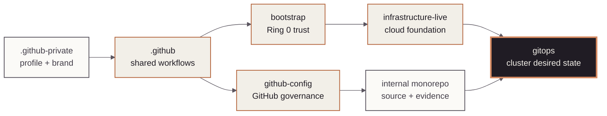

<!-- mindclade-doc: repository-home@2 -->
<!-- Brand source: mindclade/.github-private/mindclade-brand-assets (MONO family). -->

<p align="center">
  <picture>
    <source media="(prefers-color-scheme: dark)" srcset="docs/assets/brand/mono-wordmark-dark-1080w.png">
    <source media="(prefers-color-scheme: light)" srcset="docs/assets/brand/mono-wordmark-1080w.png">
    
  </picture>
</p>

<p align="center">
  
  
  
  
</p>

# Mindclade · GitOps

> **Platform Foundation · Kubernetes desired state**
> Review immutable artifact selection, admission policy, and Argo CD reconciliation as Git
> changes before they reach a cluster.

| Repository contract | Value |
| --- | --- |
| Class | `production-control` |
| Visibility | `internal` |
| Change model | `pull-request` |
| Authority | `argocd-installation`<br>`argocd-configuration`<br>`kubernetes-desired-state`<br>`promotion`<br>`admission-policy` |
| Primary readers | Platform engineers and service owners |
| First success | [Render and validate desired state](#quick-start) |
| Start here | [`docs/README.md`](docs/README.md) |

## Mission

`gitops` owns the desired state reconciled into Mindclade Kubernetes clusters. Platform and
service owners use it to review Argo CD composition, AppProjects, immutable artifact selection,
environment promotion, and Gatekeeper policy without granting pull-request jobs cluster access.

## Authority boundary

### This repository creates

- Pinned Argo CD installation and configuration, root applications, and project boundaries.
- Environment ApplicationSets, immutable deployment selections, and rendered Kubernetes state.
- Admission constraints, policy tests, promotion controls, and rollback source.

### This repository deliberately does not create

- GCP projects, networks, clusters, cloud identities, or Binary Authorization infrastructure;
  those belong to `infrastructure-live`.
- Containers, application source, model artifacts, or release qualification; those belong to
  the monorepo and its protected build system.
- Plaintext secrets; Git contains references only.

## Quick start

Prerequisite: Nix with flakes enabled. This path needs no cluster, Argo CD, or cloud credentials
and performs no reconciliation.

```sh
nix develop .#ci --command make validate
nix flake check --no-update-lock-file
```

**Success means:** generated provenance, bootstrap checksums, YAML, project boundaries, policy
fixtures, deployment selections, shell checks, and repository contracts all pass.

**If it fails:** change the authored source, regenerate through the repository command, and
review both source and rendered output. Never repair a failure by hand-editing generated files.

**Safety boundary:** do not sync Argo CD, run `kubectl apply`, promote an artifact, or change a
production freeze from a development session.

## Estate position

The highlighted node is this repository. Its contract and boundary lists are the text equivalent
of the upstream artifact and infrastructure relationships.



## Repository map

| Path | Purpose |
| --- | --- |
| `bootstrap/` | Pinned Argo CD payloads, profiles, root app, and audited bootstrap source. |
| `applications/` | Environment ApplicationSets. |
| `projects/` | Repository, cluster, and namespace allowlists. |
| `policy/` | Gatekeeper templates, constraints, fixtures, and expiring exemptions. |
| `deployments/` | Environment-specific immutable artifact selections. |
| `overlays/` | Reviewed environment values and patches. |
| `roots/` | Environment root composition and sync controls. |

## Change path

Change authored inputs, regenerate derived output, and review both source and provenance. Pull
requests must pass render, policy, RBAC, artifact, and repository gates. Promotion preserves
reviewed artifacts across environments; protected workflows own reconciliation, rollback, and
emergency operations. Never hand-edit generated output.

## Documentation and support

- [Documentation home](docs/README.md)
- [Architecture](docs/architecture.md)
- [Workload activation](docs/workload-activation.md)
- [Failed sync](docs/failed-sync.md)
- [Rollback](docs/rollback.md)
- [Disaster recovery](docs/disaster-recovery.md)
- [Contributing](CONTRIBUTING.md)
- Policies and terms: [governance](GOVERNANCE.md) · [conduct](CODE_OF_CONDUCT.md) ·
  [support](SUPPORT.md) · [legal](LEGAL.md) · [license](LICENSE) · [notice](NOTICE) ·
  [changes](CHANGELOG.md)

## Security

Never commit secret payloads, private keys, kubeconfigs, cluster credentials, or mutable image
references. Report vulnerabilities through [the private security process](SECURITY.md).
