<!-- mindclade-doc: repository-home@1 -->

<!-- Brand source: mindclade/.github-private/mindclade-brand-assets (MONO family). -->

<p align="center">
  <picture>
    <source media="(prefers-color-scheme: dark)" srcset="docs/assets/brand/mono-wordmark-dark-1080w.png">
    <source media="(prefers-color-scheme: light)" srcset="docs/assets/brand/mono-wordmark-1080w.png">
    
  </picture>
</p>

<picture>
  <source media="(prefers-color-scheme: dark)" srcset="../mindclade-brand-assets/png/mc-lockup-horizontal-dark-1080w.png">
  <source media="(prefers-color-scheme: light)" srcset="../mindclade-brand-assets/png/mc-lockup-horizontal-1080w.png">
  
</picture>

# Mindclade · GitOps

> **Platform Foundation · Kubernetes desired state**
> Reviewed, rendered, policy-checked manifests reconciled by environment-scoped Argo CD.

| Repository contract | Value |
| --- | --- |
| Enterprise | [`mindclade`](https://github.com/enterprises/mindclade) |
| Organization | [`mindclade`](https://github.com/mindclade) |
| Repository index | [Mindclade repositories](https://github.com/orgs/mindclade/repositories) |
| Repository | [`mindclade/gitops`](https://github.com/mindclade/gitops) |
| Class | `production-control` |
| Visibility | `internal` |
| Owner | Platform |
| Production authority | Yes |
| Change model | Pull request to `main`; generated render; development-to-production promotion |
| Documentation | [`docs/README.md`](docs/README.md) |

This repository is the only source of truth for Argo CD and in-cluster Kubernetes desired
state. `rendered/` contains plain YAML produced from pinned monorepo source; Argo CD performs
no Helm or Kustomize rendering at reconciliation time.

> **Generated content:** Never hand-edit `rendered/`. Change its source or deployment
> selection and run the renderer. CI rejects files without generated provenance and the
> credentialed render workflow detects drift from the pinned source.

## Authority boundary

`gitops` owns Argo CD composition, AppProjects, ApplicationSets, Gatekeeper policy,
environment artifact selection, and rendered Kubernetes resources. `infrastructure-live`
owns clusters, Binary Authorization, cloud identities, DNS, and secret backends. The internal
monorepo owns workload source and build outputs.

The diagram shows the reviewed path from workload source to a reconciled cluster and the two
distinct admission responsibilities.

```mermaid
%%{init: {"theme":"base","themeVariables":{"primaryColor":"#F2EFE8","primaryTextColor":"#201C24","primaryBorderColor":"#B5673F","secondaryColor":"#FBFAF7","tertiaryColor":"#FBFAF7","lineColor":"#5B5660","edgeLabelBackground":"#FBFAF7","clusterBkg":"#FBFAF7","clusterBorder":"#E2DED4"}}}%%
flowchart LR
    SRC["Internal monorepo<br/>workload source"] -->|"pinned ref + content locks"| R["scripts/render.py"]
    SEL["deployments/*.yaml<br/>approved digests"] --> R
    R --> DEV["rendered/development<br/>generated YAML"]
    DEV -->|"bit-identical promotion"| STG["rendered/staging"]
    STG -->|"bit-identical promotion"| PROD["rendered/production"]
    PROD --> PR["Reviewed Git commit"]
    PR --> ARGO["Environment Argo CD<br/>read-only repository access"]
    ARGO --> GK["Gatekeeper<br/>structure, registry, digest"]
    GK --> BA["Binary Authorization<br/>cryptographic attestation"]
    BA --> GKE["GKE workload"]

    classDef authority fill:#201C24,color:#F2EFE8,stroke:#D68A61,stroke-width:2px;
    classDef managed fill:#F2EFE8,color:#201C24,stroke:#B5673F,stroke-width:1.5px;
    classDef external fill:#FBFAF7,color:#423D48,stroke:#5B5660,stroke-width:1.5px;
    class SRC,SEL,PR authority;
    class R,DEV,STG,PROD,ARGO,GK,BA,GKE managed;
```



## Repository map

| Path | Ownership |
| --- | --- |
| `bootstrap/` | Pinned Argo CD payloads, configuration, root app, and audited bootstrap script |
| `applications/` | Hand-authored environment ApplicationSets |
| `projects/` | Hand-authored AppProject repository, cluster, and namespace allowlists |
| `policy/` | Gatekeeper templates, constraints, tests, and expiring exemptions |
| `overlays/` | Hand-authored environment values and patches |
| `deployments/` | Environment-specific immutable artifact selections |
| `render-manifest.yaml` | Pinned monorepo source and render target inventory |
| `rendered/` | CI-generated plain YAML consumed by Argo CD |
| `roots/` | Environment root composition |

## Render and validate

Enter the pinned shell. The renderer requires a checkout of the internal monorepo at the ref
declared in `render-manifest.yaml`.

```sh
nix develop
make validate
python3 scripts/render.py --monorepo ../mindclade-internal-monorepo
kubeconform -strict -summary -ignore-missing-schemas rendered/
gator verify policy/tests/suite.yaml
gator test --filename=policy/templates --filename=policy/constraints \
  --filename=rendered/development
```

`gator verify` proves constraints reject known-bad fixtures; `gator test` evaluates actual
rendered resources. Both are required to distinguish working policy from a clean estate.

## Promotion contract

Promotion copies manifests bit-identically from development to staging and then production,
apart from the reviewed namespace overlay. It does not re-render. CI fails a promotion pull
request that changes anything outside the allowed transformation, making the reviewed diff
the exact cluster delta.

Gatekeeper enforces structural admission requirements such as approved registries and
immutable digests. Google Cloud Binary Authorization is the single cryptographic admission
gate. This repository intentionally does not deploy a second signature admission controller.

## Start here

- [Documentation index](docs/README.md)
- [Architecture](docs/architecture.md)
- [Workload activation](docs/workload-activation.md)
- [Policy rollout and testing](policy/README.md)
- [Rollback](docs/rollback.md)
- [Disaster recovery](docs/disaster-recovery.md)
