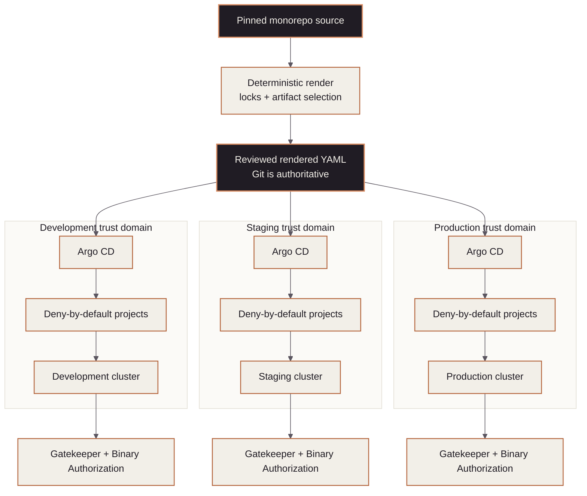

<!-- mindclade-doc: architecture@1 -->

# Mindclade · GitOps architecture

> **Audience:** Platform, security, infrastructure, and service engineers
> **Outcome:** Understand rendering, environment isolation, admission controls, and recovery
> boundaries before changing cluster desired state.

## Context

The repository converts pinned workload source and approved artifact selections into plain
Kubernetes YAML. The generated output is reviewed and committed before Argo CD observes it,
so the pull-request diff is the intended cluster delta.

## Authority boundary

### Owns

- Argo CD bootstrap configuration, environment roots, AppProjects, and ApplicationSets;
- rendered Kubernetes desired state and environment promotion;
- Gatekeeper templates, constraints, tests, and expiring exemptions; and
- ExternalSecret or CSI references to externally managed secret values.

### Depends on

- `infrastructure-live` for GKE, networking, cloud identities, Binary Authorization, DNS,
  Secret Manager, and other cloud prerequisites;
- the internal monorepo for pinned Kustomize workload source and build evidence; and
- `.github` and `github-config` for workflow implementation, policy, access, and environments.

### Explicitly excludes

- cloud resources, secret values, application source, image building, and live manual
  mutation as a normal operating model.

## Component model

Each environment has its own Argo CD trust domain and can discover only its own root,
ApplicationSets, destinations, and rendered paths.

| Component | Responsibility | Source of truth |
| --- | --- | --- |
| Renderer | Verify locks, render sources, select exact digests, write provenance | `scripts/render.py` |
| Deployment selections | Choose immutable artifacts per environment | `deployments/*.yaml` |
| Argo roots | Compose one environment's control plane | `roots/<environment>/` |
| AppProjects | Restrict sources, destinations, namespaces, and resource kinds | `projects/` |
| ApplicationSets | Discover only claimed generated directories | `applications/` |
| Gatekeeper | Structural Kubernetes admission policy | `policy/` |
| Binary Authorization | Cryptographic artifact admission | `infrastructure-live` |

## Change and promotion flow

The renderer verifies that the monorepo checkout resolves to the pinned ref and that remote
content matches declared hashes and byte counts. It fails closed on render errors, missing
artifact selections, unsafe output names, and unexpected generated drift.

Development receives newly rendered output. Promotion copies only an approved application's
immutable release-record selection to the adjacent environment; it never
copies environment-specific replicas, quotas, configuration, or rendered bytes. Each environment
then renders independently and CI verifies deterministic output. Promotion integrity compares each
candidate target against the adjacent source in the exact event base, using the pull-request merge
commit or merge-group head as the candidate. One change therefore cannot leapfrog an unqualified
selection across environments or validate a tree different from the one GitHub will merge. Argo CD
reads this repository but cannot write it, and reconciles only its environment. The built-in
`default` AppProject is deny-all; the bootstrap project is restricted to the resources needed to
establish Argo composition.

## Trust and security boundaries

GitHub review and CI establish source, render, and promotion evidence. Gatekeeper verifies
structural preconditions such as registry and digest form. Binary Authorization is the single
runtime cryptographic attestation decision. The controls are complementary and intentionally
do not duplicate signature admission.

Every pull request and merge-queue candidate also receives a deterministic desired-state impact
report. It compares exact base and head commits and records affected environments, applications,
namespaces, image references, AppProject authority expansions, policy changes, and newly enabled
pruning in a machine-readable artifact. A critical report is review input, not connected evidence:
it cannot observe Argo live state and never authenticates to a cluster.

For pull requests, `impact-report.yml` is loaded by `pull_request_target` from the default branch,
has only `contents: read`, and runs the base checkout's Nix shell, analyzer, and JSON schema. The
merge candidate is checked out separately and treated only as Git/YAML data; candidate scripts are
never executed. The analyzer rejects a range unless the recorded base is an ancestor of the tested
merge commit. Top-level patch/list YAML is reported as opaque high risk instead of being silently
discarded.

Plain Kubernetes Secret payloads are prohibited. Argo repository access is a read-only GitHub
App credential installed out of band during audited bootstrap. Production bootstrap also
requires an explicit environment confirmation and a verified Kubernetes context.

ARC release runners and presubmit runners are distinct trust domains. The former retain the
restricted `mindclade-arc-artifact-authority` route; the latter are staged under the separate
`mindclade-arc-ci` contract with no signing, push, or cache-write authority. Presubmit source stays
zero-capacity and outside every Argo root until its Nix image, cache, WIF, runner-group, cluster,
and workflow-routing evidence are independently qualified. See
[ARC CI activation](arc-ci-activation.md).

ApplicationSet-generated Applications do not carry cascading resource-deletion finalizers, and
every ApplicationSet enables `preserveResourcesOnDeletion`. Resource pruning remains an explicit
per-environment sync-policy decision, while deletion of an ApplicationSet or environment root
cannot silently turn into workload deletion.

Production deny windows block automated and manual sync. A reviewed GitHub freeze override only
authorizes the Git merge; the separate, audited cluster-admin procedure in
[Freeze and emergency change](freeze-and-emergency.md) permits one exact live sync and then
restores the committed deny state.

## Failure domains and recovery

| Failure | Containment | Recovery |
| --- | --- | --- |
| Render failure or lock mismatch | No generated update | Fix source or verified lock; never suppress in CI |
| Invalid policy | Behavior fixtures or rendered evaluation fail | Correct policy and repeat dry-run rollout |
| Argo sync failure | One environment/application boundary | Use [failed sync](failed-sync.md) |
| Bad deployment | Git remains authoritative | Use [rollback](rollback.md) |
| Lost Argo control plane | Cloud resources and Git desired state remain separate | Use [disaster recovery](disaster-recovery.md) |
| Lost cloud prerequisite | GitOps cannot recreate it | Recover through `bootstrap` and `infrastructure-live` first |

## Invariants

- `rendered/` is generated and never hand-edited.
- Promotion carries the same immutable artifact and never overwrites environment configuration.
- Environment Argo instances cannot deploy to another environment.
- Argo has read-only repository access.
- Gatekeeper and Binary Authorization retain distinct structural and cryptographic roles.
- Secret values never enter Git.
- Deleting an ApplicationSet or root does not cascade-delete managed workload resources.
- A production deny window has no standing manual-sync bypass.

## Related documentation

- [Workload activation](workload-activation.md)
- [Policy rollout and testing](../policy/README.md)
- [Secrets](secrets.md)
- [Disaster recovery](disaster-recovery.md)
